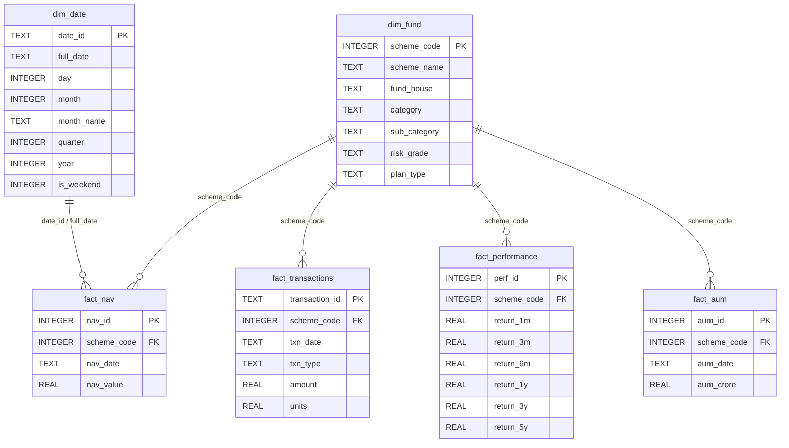

# Bluestock Mutual Fund Analytics

An end-to-end data engineering and analytics pipeline designed for profiling Asset Management Company (AMC) funds, validating historical Net Asset Value (NAV) data, fetching real-time AMFI indices, storing data in an SQLite database using a Star Schema, executing analytical queries, and conducting advanced risk/performance profiling (Value at Risk, Sharpe Ratio, Sortino Ratio).

---

## 🚀 Project Overview

The Bluestock Mutual Fund Analytics project operates on a multi-stage architecture:
1. **Sample Data Generation**: Synthetic data is dynamically generated to establish raw data baselines.
2. **REST Ingestion & API fetching**: Pulls daily real-time NAV records directly from the public [Mutual Fund API (mfapi.in)](https://api.mfapi.in).
3. **Data Quality Profiling**: Scans files for schema conformity, missing values, duplicates, and prints validation diagnostics.
4. **ETL Cleaning & Transformations**: Normalizes transactional codes, resolves temporal gaps using a daily forward-fill mechanism, parses ISO dates, and weeds out outlying values.
5. **Relational Database Loader**: Loads cleaned structured tables into an SQLite database (`bluestock_mf.db`) following a rigid Star Schema model (comprising Dimension and Fact tables).
6. **SQL Query Engine**: Executes a suite of 10 analytical SQL scripts reporting performance comparisons, average monthly NAVs, SIP rates, transaction metrics, and AUM growth.
7. **Jupyter Notebook Risk Analytics**: Executes deep-dive calculations for Value at Risk (VaR), Conditional Value at Risk (CVaR), standard deviations, Sharpe/Sortino ratios, and Portfolio Concentration (Herfindahl-Hirschman Index - HHI).
8. **Interactive Recommender CLI**: Offers a user-friendly command line interface to input risk criteria (Low, Moderate, High) and output top recommended funds using Sharpe performance metrics.
9. **Power BI Visualizations**: Includes a pre-configured dashboard visual report (`bluestock_mf_dashboard.pbix`) detailing asset allocations, risk metrics, and transaction behaviors.

---

## 📁 Directory Structure

```text
mutual-fund-analytics/
├── data/
│   ├── raw/                           # Raw input CSV files (generated/live downloaded)
│   └── processed/                     # Cleaned, standardized CSV files ready for DB import
├── reports/                           # Quality assurance logs, metrics charts, and analytical plots
│   └── data_quality_summary.txt       # Automated QA report generated by validation runs
├── sql/
│   ├── schema.sql                     # SQLite relational Star Schema tables DDL scripts
│   └── queries.sql                    # Set of 10 compiled analytical SQL queries
├── Advanced_Analytics                 # Jupyter Notebook for VaR, CVaR, and risk charts
├── EDA_Analysis                       # Jupyter Notebook for correlation matrices & profiles
├── Performance_Analytics              # Jupyter Notebook for Sharpe/Sortino & AUM trends
├── bluestock_mf.db                    # Compiled SQLite relational database file
├── bluestock_mf_dashboard.pbix        # Power BI Desktop visualization report
├── clean_data.py                      # Data cleaning script (date parsing, ffills, mapping)
├── create_data_dictionary.py          # Script to generate markdown schema documentation
├── create_database.py                 # SQLite DB creation and data loader script
├── create_sample_data.py              # Sample raw dataset generator
├── data_dictionary.md                 # Auto-generated markdown schema data dictionary
├── data_ingestion.py                  # Schema profiling and dataset diagnostic loader
├── explore_fund_master.py             # Exploration profile script for raw Fund Master details
├── live_nav_fetch.py                  # Real-time NAV API download script
├── recommender.py                     # CLI Interactive Fund Recommendation tool
├── run_pipeline.py                    # Master orchestrator execution script
└── requirements.txt                   # Project Python library dependencies lists
```

---

## 🛠️ Setup and Installation

### 1. Prerequisites
Ensure you have **Python 3.8 or higher** installed.

### 2. Set Up a Virtual Environment (Recommended)
Isolate dependencies by setting up a virtual environment in the project directory:

**Windows (Command Prompt / PowerShell):**
```cmd
python -m venv venv
venv\Scripts\activate
```

**macOS / Linux:**
```bash
python3 -m venv venv
source venv/bin/activate
```

### 3. Install Dependencies
Install all required libraries specified in `requirements.txt`:
```bash
pip install -r requirements.txt
```

---

## ⚙️ How to Run the ETL Pipeline

Orchestrate the entire pipeline from data generation through parsing, loading, querying, and catalog documentation using the master runner script:

```bash
python run_pipeline.py
```

### Options & Flags
* **`--skip-live`**: Runs the entire pipeline but skips Step 3 (live API calls from `mfapi.in`). Use this flag if you are running offline, have API limits, or want a faster execution using existing raw datasets.
  ```bash
  python run_pipeline.py --skip-live
  ```
* **`-h` / `--help`**: Displays the CLI instructions and docstring options.
  ```bash
  python run_pipeline.py --help
  ```

### Automated Steps Executed:
1. **Generate Raw Samples** (`create_sample_data.py`) - Creates the initial raw files.
2. **Ingest Profile** (`data_ingestion.py`) - Evaluates the schema layout of raw CSVs.
3. **Download Live NAVs** (`live_nav_fetch.py`) - Fetches real-time prices from the public REST API.
4. **Clean Datasets** (`clean_data.py`) - Applies transformations and forward-fills weekend data gaps.
5. **Compile Database** (`create_database.py`) - Builds `bluestock_mf.db` tables and imports clean rows.
6. **Execute Queries** (`write_queries.py`) - Runs 10 analytical SQL scripts and logs statements to `sql/queries.sql`.
7. **Explore Categoricals** (`explore_fund_master.py`) - Evaluates distributions for risk grades and plan structures.
8. **Assert Quality QA** (`validate_data.py`) - Performs integrity checks and exports a report to `reports/data_quality_summary.txt`.
9. **Update Dictionary** (`create_data_dictionary.py`) - Updates schema definitions in `data_dictionary.md`.

---

## 📊 Database Schema Summary

The database uses a clean relational Star Schema structure:



*For granular database descriptions and fields classifications, refer to the auto-generated documentation in [data_dictionary.md](file:///c:/Users/Nithya%20Shree/Desktop/mutual-fund-analytics/data_dictionary.md).*

---

## 🏆 Fund Recommender Tool

The project includes an interactive terminal command line tool to recommend the top 3 funds based on Sharpe ratio returns matching your risk tolerance:

```bash
python recommender.py
```
### Running the Recommender:
1. Run the script.
2. Enter your risk appetite: **Low**, **Moderate**, or **High**.
3. The tool evaluates the Sharpe ratio profiles and lists the top 3 corresponding funds.
4. Type **Exit** to shut down the recommendation console loop.

---

## 📈 Jupyter Notebook Analysis

Launch the notebook interface:
```bash
jupyter notebook
```

The repository includes three advanced analytics notebooks:
1. **`Advanced_Analytics`**: Computes daily returns, historical Value at Risk (VaR at 95% confidence), and Conditional Value at Risk (CVaR). Outputs analytics plots inside the `reports/` folder.
2. **`EDA_Analysis`**: Develops category heatmaps, correlation matrices, AUM trends, and asset category distribution charts.
3. **`Performance_Analytics`**: Calculates cumulative performance metrics (Sharpe ratio, Sortino ratio, CAGR comparisons, rolling Sharpe ratios) and sector holdings concentration (HHI index).

---

## 🎛️ Power BI Dashboard

The project includes a ready-to-use Power BI dashboard file: `bluestock_mf_dashboard.pbix`.

### To view and refresh data:
1. Install **Power BI Desktop** (available on Windows).
2. Open `bluestock_mf_dashboard.pbix`.
3. The dashboard connects to the local SQLite database file `bluestock_mf.db` via an SQLite ODBC Connection or folder import.
4. Click **Refresh** in Power BI Desktop to load updated details from the database files after running the ETL pipeline.
5. Key tabs inside the dashboard cover:
   * **Dashboard Summary**: Key performance indicators, direct vs regular cost weights, and fund allocations.
   * **Dashboard Transactions**: Detailed tracking of investor BUY/SELL/SIP transactions.
